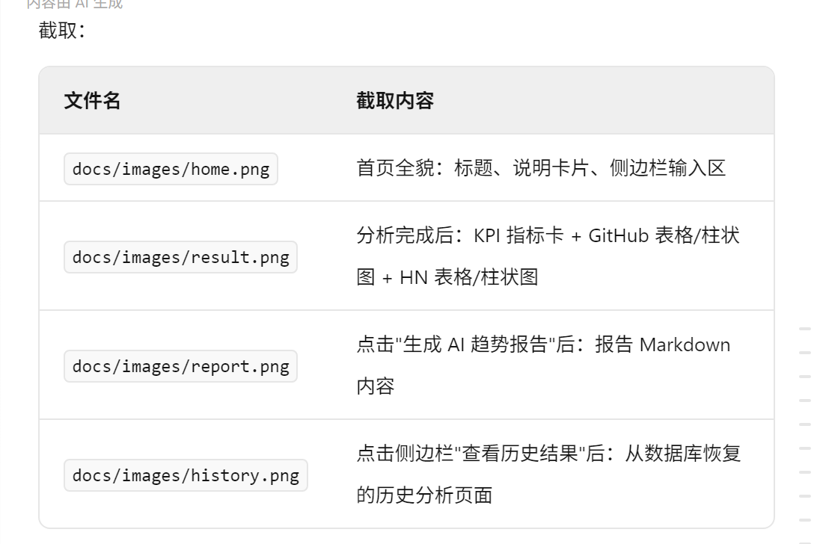
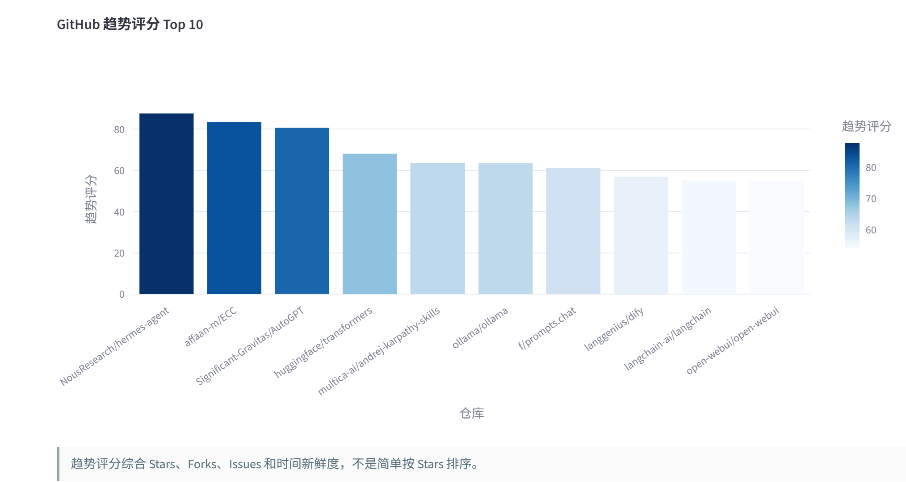
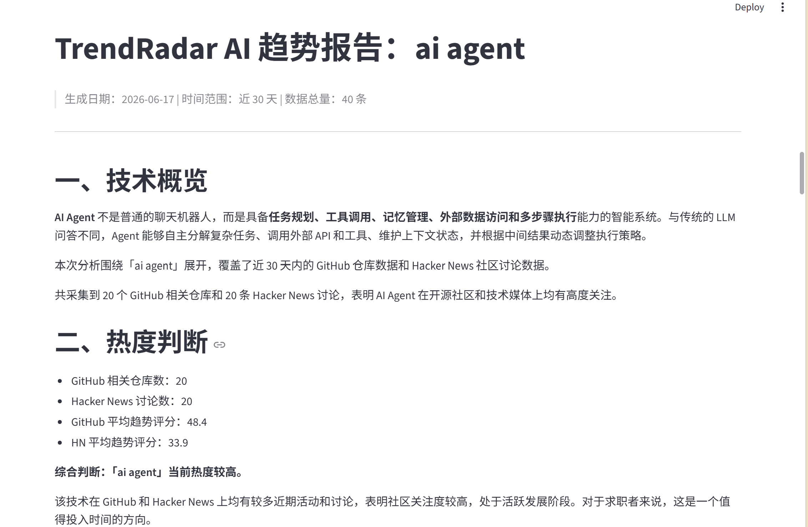
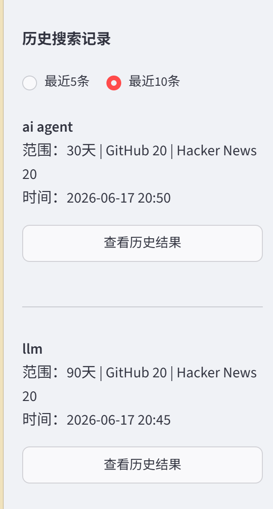

# TrendRadar

面向求职与技术选型的 AI 趋势情报平台。

输入技术关键词（如 AI Agent、LangGraph、FastAPI），自动采集 GitHub 和 Hacker News 近期数据，计算趋势评分，生成面向求职选题和技术调研的分析报告。

---

## 项目背景

技术迭代速度快，求职者和开发者经常面临这些问题：

- 某项技术是否值得投入时间学习？
- 简历项目应该围绕哪个技术方向选题？
- 团队技术选型有什么数据可以参考？

只看 Stars 或 Points 无法区分"历史热门"和"当前热门"——一个 5 年前获得 10000 stars 的项目可能已经停止维护，而一个上周刚发布的项目可能正在快速增长。

TrendRadar 通过多维度数据采集和加权评分，提供更客观的技术趋势判断。

## 核心功能

**多源数据采集** — 同时调用 GitHub Search Repositories API 和 Algolia HN Search API，采集近期活跃的仓库和讨论数据。两个数据源独立运行，单个源失败不影响另一个。

**多级 fallback 查询** — GitHub 采集器实现 3 级 fallback（精确匹配 + 限定时间 → 名称/描述/标签匹配 → 简化关键词 + 不限时间），HN 采集器实现 2 级 fallback，提高数据召回率。

**趋势评分模型** — 综合 Stars、Forks、Issues、Points、评论数和时间新鲜度，通过归一化和加权公式计算 0-100 趋势评分。时间新鲜度模块让近期活跃的项目获得更高排名。

**相关性筛选** — 报告中的 GitHub 代表项目经过相关性评分过滤，排除面试指南、算法题库、awesome 资料集合等与搜索关键词不直接相关的项目。

**AI 趋势报告 Agent** — 双模式运行：模板模式（无需 API Key，基于规则生成 9 章节报告）和 LLM 模式（可选，调用 OpenAI 兼容 API 生成深度分析）。关键词为 AI Agent 时，报告内容围绕 Agent 安全、工具调用、任务规划、成本控制等话题展开。

**SQLite 历史记录** — 每次搜索自动持久化到数据库（4 张表），侧边栏展示搜索历史，支持回溯查询。

**Markdown 报告导出** — 报告自动保存为 Markdown 文件到 `data/reports/` 目录，数据库同步记录。

## 技术栈

| 类别 | 技术 |
|------|------|
| 前端 | Streamlit |
| 后端 | Python 3.11+ |
| 数据采集 | Requests |
| 数据处理 | Pandas, NumPy |
| 数据库 | SQLite + SQLAlchemy 2.x |
| 可视化 | Plotly |
| 报告 | Markdown 模板引擎 + OpenAI 兼容 API（可选） |
| 测试 | pytest 风格自测脚本 |

## 系统架构

```
┌─────────────────────────────────────────────┐
│              Streamlit 前端 (app.py)          │
│  关键词输入 → 结果展示 → 报告生成 → 历史查询    │
└──────┬──────────┬──────────┬────────────────┘
       │          │          │
  ┌────▼────┐ ┌──▼───┐ ┌───▼──────┐
  │Collector│ │Scoring│ │  Agent   │
  │ GitHub  │ │Service│ │ TrendAgent│
  │   HN    │ │       │ │  Report  │
  └────┬────┘ └──┬───┘ │  Service │
       │         │     └───┬──────┘
       │         │         │
  ┌────▼─────────▼─────────▼────┐
  │      SQLite + SQLAlchemy     │
  │ search_history / results /   │
  │ reports                      │
  └─────────────────────────────┘
```

## 数据流程

```
用户输入关键词 + 时间范围
        ↓
  ┌─────┴─────┐
  ↓           ↓
GitHub API   HN API        ← 并行采集
  ↓           ↓
仓库数据     帖子数据
  ↓           ↓
归一化 + 加权评分             ← scoring_service
  ↓
trend_score (0-100) + ranking
  ↓
前端展示（表格 + 柱状图 + 排行榜）
  ↓
用户点击"生成报告"
  ↓
相关性筛选（过滤资料类项目）    ← trend_agent
  ↓
模板/LLM 生成 9 章节报告       ← trend_agent
  ↓
保存 Markdown 文件 + DB 记录   ← report_service + repository
```

## 趋势评分模型

### 为什么不能只看 Stars

Stars 是累积指标，无法反映当前活跃度。趋势评分模型加入时间新鲜度维度，让近期活跃的项目排名更靠前。

### 评分公式

**GitHub 仓库：**

```
trend_score = Stars × 0.4 + Forks × 0.2 + Issues × 0.1 + 新鲜度 × 0.3
```

**Hacker News 帖子：**

```
trend_score = Points × 0.4 + 评论数 × 0.3 + 新鲜度 × 0.3
```

各维度先做 min-max 归一化到 0-100，再加权求和。

### 时间新鲜度

| 时间距离 | 新鲜度分数 |
|----------|-----------|
| 今天 | 100 |
| 7 天内 | 90 - 100 |
| 30 天内 | 50 - 90 |
| 90 天内 | 10 - 50 |
| 超过 90 天 | 10 |

### 相关性筛选

报告中的 GitHub Top 5 项目经过 `report_relevance_score` 排序：

- repo_name 命中关键词相关词：+3
- description 命中关键词相关词：+2
- owner/url 属于 AI/LLM 生态：+1
- 资料类项目（interview/guide/leetcode/awesome）：-2，充足时硬过滤

## AI 报告 Agent

### 双模式设计

| 模式 | 触发条件 | 说明 |
|------|---------|------|
| 模板模式 | 默认，无需 API Key | 基于规则生成完整 9 章节报告 |
| LLM 模式 | 配置 LLM_API_KEY | 调用 OpenAI 兼容 API，失败自动回退 |

### 报告内容（9 个章节）

1. **技术概览** — 技术背景和发展阶段
2. **热度判断** — 基于数据的热度等级评估
3. **GitHub 项目解读** — 代表项目分析（含相关性筛选）
4. **HN 讨论分析** — 社区话题和关注点总结
5. **典型业务场景** — 3-7 个应用场景
6. **国内生态建议** — 国内落地现状和替代方案
7. **求职项目推荐** — 具体项目方向 + 技术栈 + 求职能力
8. **面试常见问题** — 6-8 个面试问题及回答要点
9. **学习路径建议** — 分阶段学习路径 + 推荐资源

关键词为 AI Agent 时，各章节围绕 Agent 特有话题展开（工具调用、任务规划、安全控制、成本优化等）。

## 运行步骤

### 1. 安装依赖

```bash
git clone <your-repo-url>
cd trendradar-project
python -m venv .venv
# Windows:
.venv\Scripts\activate
# macOS/Linux:
source .venv/bin/activate
pip install -r requirements.txt
```

### 2. 配置环境变量（可选）

```bash
cp .env.example .env
```

编辑 `.env`：

```env
# GitHub 个人访问令牌（可选，不填则使用公开接口，有速率限制）
GITHUB_TOKEN=

# LLM API 配置（可选，不填时使用模板模式，报告仍然可用）
LLM_API_KEY=
LLM_BASE_URL=
LLM_MODEL=
```

所有配置均为可选，不填时项目以降级模式运行：

- **不配置 LLM_API_KEY** 也可以正常运行，使用本地模板报告（包含完整 9 章节）
- **配置 LLM_API_KEY 后**，Agent 可调用 OpenAI 兼容模型生成更深入的分析报告
- **GITHUB_TOKEN** 是可选项，用于提升 GitHub API 请求稳定性和速率限制

### 3. 启动 Web 界面

```bash
streamlit run app.py
```

### 4. 运行测试

```bash
# 运行全部测试（评分 + 数据库 + Agent）
python main.py test

# 单独运行 Agent 测试
python -m tests.test_agent
```

## 测试覆盖

| 测试文件 | 覆盖范围 |
|---------|---------|
| test_scoring.py | 归一化、新鲜度、GitHub/HN 评分、空值处理 |
| test_database.py | 初始化、增删改查、空数据 |
| test_agent.py | 模板报告、空数据容错、相关性评分、资料类过滤、Agent 内容、DB 保存 |

## 页面截图

### 首页与分析设置



> 截图占位：部署后替换为 `docs/images/home.png`，展示关键词输入框、项目说明卡片和侧边栏。

### 趋势评分与排行榜



> 截图占位：部署后替换为 `docs/images/result.png`，展示 KPI 指标卡、GitHub/Hacker News 表格和趋势评分柱状图。

### AI 趋势报告预览



> 截图占位：部署后替换为 `docs/images/report.png`，展示生成的 AI 趋势报告内容。

### 历史记录回看



> 截图占位：部署后替换为 `docs/images/history.png`，展示点击历史记录后从数据库恢复的分析结果。

## 项目亮点

1. **多源数据采集 + 多级 fallback**：两个独立数据源，单个源失败不影响另一个。GitHub 3 级 fallback 查询策略，在 API 限流和搜索无结果时仍能提供数据。

2. **多维度趋势评分**：不是简单的 Stars 排序，而是综合 Stars、Forks、Issues、Points、评论数和时间新鲜度的加权模型。时间维度让近期活跃项目排名更靠前。

3. **报告相关性筛选**：通过 `report_relevance_score` 算法过滤面试指南和资料集合类项目，保证报告内容与搜索关键词高度相关。

4. **双模式 Agent**：模板模式保证零配置可用，LLM 模式增强分析深度，失败自动回退。Agent 根据关键词自动切换通用模板和领域特定内容。

5. **完整持久化**：SQLite 4 张表覆盖搜索历史、评分结果和报告记录，支持回溯查询。

## 项目结构

```
trendradar-project/
├── app.py                     # Streamlit 前端入口
├── main.py                    # 命令行入口
├── requirements.txt           # Python 依赖
├── .env.example               # 环境变量模板
├── .gitignore                 # Git 忽略规则
├── .env.example               # 环境变量模板
├── collectors/                # 外部数据采集
│   ├── base.py                # 采集器基类（安全请求封装）
│   ├── github_collector.py    # GitHub API（3 级 fallback）
│   └── hn_collector.py        # HN API（2 级 fallback）
├── services/                  # 业务逻辑
│   ├── scoring_service.py     # 趋势评分模型
│   └── report_service.py      # 报告生成与 Markdown 导出
├── agent/                     # AI 报告 Agent
│   ├── trend_agent.py         # 双模式 Agent（模板 + LLM）
│   └── prompts.py             # LLM 提示词模板
├── database/                  # 数据库
│   ├── db.py                  # 连接管理与自动初始化
│   ├── models.py              # ORM 模型（4 张表）
│   └── repository.py          # 存取函数
├── tests/                     # 自动化测试
│   ├── test_scoring.py
│   ├── test_database.py
│   └── test_agent.py
├── data/reports/              # Markdown 报告文件
└── docs/                      # 项目文档
    ├── 项目说明.md
    ├── 面试讲解稿.md
    ├── 简历写法.md
    ├── 后续优化方向.md
    └── images/                # 页面截图（部署后补充）
```

## 后续优化方向

详见 [docs/后续优化方向.md](docs/后续优化方向.md)，主要包括：

- 接入 V2EX、掘金、InfoQ 等国内数据源
- 定时任务与周报推送
- Redis 缓存层
- Docker 部署
- FastAPI 接口层
- React 前端
- 评分权重学习

## 免责声明

本项目数据来自 GitHub Search Repositories API 和 Hacker News Algolia Search API 等公开接口，仅用于个人学习、技术调研和求职项目展示。项目不涉及任何商业数据或用户隐私数据。报告内容由规则模板或第三方 LLM 生成，仅供参考，不构成任何技术选型建议。
